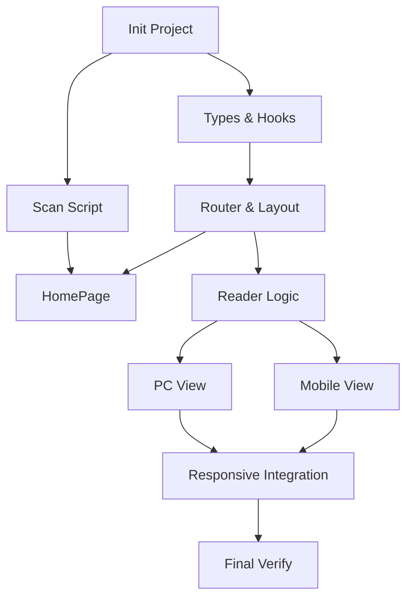

# TASK: MVP1 - 任务分解清单

## 1. 基础设施与环境搭建 (Infrastructure)
- [ ] **TASK-01: 初始化前端工程**
    - **Input**: `web/` 目录为空。
    - **Action**: 使用 Vite 创建 React + TS 项目，安装 Tailwind CSS, React Router, `react-pageflip`, `lucide-react` (图标)。
    - **Output**: 可运行的 Hello World 页面，Tailwind 样式生效。
- [ ] **TASK-02: 实现扫描脚本 (scan-stories.js)**
    - **Input**: `stories/` 目录下的原始文件。
    - **Action**: 编写 Node.js 脚本，遍历 `../stories`，提取元数据，生成 `web/public/story-manifest.json`。
    - **Output**: 可执行的脚本 `npm run scan`，生成正确的 JSON 索引。

## 2. 核心逻辑层 (Core Logic)
- [ ] **TASK-03: 定义类型与数据 Hook**
    - **Input**: DESIGN 文档中的 TS 接口。
    - **Action**: 创建 `src/types/index.ts`，实现 `useStoryManifest` (加载索引) 和 `useStoryData` (加载特定故事详情) hooks。
    - **Output**: 类型安全的 Hooks，能从 public 或 API 获取数据。
- [ ] **TASK-04: 配置路由与布局**
    - **Input**: 现有 App.tsx。
    - **Action**: 配置 React Router，创建 Layout 组件（包含 Header），定义 `/` 和 `/read/:id` 路由。
    - **Output**: 页面可导航，Header 在所有页面显示。

## 3. 功能模块开发 (Feature Implementation)
- [ ] **TASK-05: 开发首页 (HomePage)**
    - **Input**: `useStoryManifest` hook。
    - **Action**: 实现故事网格展示、搜索框（过滤 Title）、风格筛选下拉框。
    - **Output**: 首页能展示所有故事，并能根据条件筛选。
- [ ] **TASK-06: 开发阅读器状态管理 (Reader Container)**
    - **Input**: `/read/:id` 路由参数。
    - **Action**: 在 `ReadPage` 中管理状态：当前页码、当前语言 (ZH/EN)、当前风格。实现数据加载逻辑。
    - **Output**: 进入阅读页能 log 出当前页面的文本和图片路径，支持切换语言/风格状态。

## 4. UI 适配与组件 (UI & Adaptation)
- [ ] **TASK-07: 实现 PC 端仿真翻页 (FlipBookViewer)**
    - **Input**: 页面数据数组。
    - **Action**: 封装 `react-pageflip`，实现双页显示模式。
    - **Output**: PC 端可翻页阅读。
- [ ] **TASK-08: 实现移动端滑动视图 (ScrollViewer)**
    - **Input**: 页面数据数组。
    - **Action**: 实现垂直滚动布局，图片宽度 100% 自适应。
    - **Output**: 移动端可流畅阅读。
- [ ] **TASK-09: 响应式切换与控制栏**
    - **Input**: 屏幕宽度 Hook。
    - **Action**: 根据宽度动态渲染 Task-07 或 Task-08 的组件；实现底部的控制栏 UI。
    - **Output**: 完整的阅读页体验。

## 5. 验证与交付 (Verification)
- [ ] **TASK-10: 全流程验收与文档**
    - **Action**: 运行 Build，测试扫描脚本，验证多端表现。编写 `README.md`。
    - **Output**: 最终交付物。

## 依赖关系图

