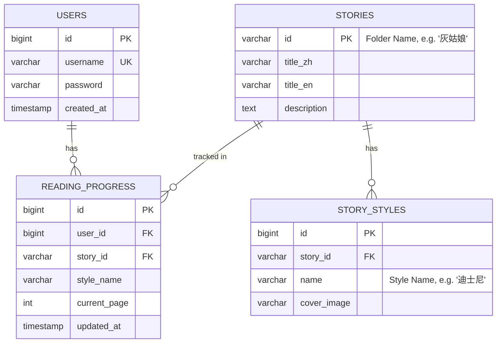

# DESIGN: MVP2 - 后端架构与数据库设计

## 1. 系统架构 (System Architecture)

采用典型的前后端分离架构。

```mermaid
graph TD
    Client[Web Client (React)] -->|REST API| LB[Spring Boot Application]
    LB -->|JPA| DB[(PostgreSQL)]
    LB -->|File IO| FS[Stories Directory]
    
    subgraph "Backend Services"
        Auth[AuthService]
        Story[StoryService]
        Sync[StorySyncService]
        History[HistoryService]
    end
    
    Story --> DB
    Sync -->|Read| FS
    Sync -->|Write| DB
```

## 2. 数据库设计 (Database Schema)

### 2.1 ER Diagram


## 3. 模块详细设计

### 3.1 故事同步服务 (StorySyncService)
- **触发时机**: 应用启动 (`ApplicationRunner`) 或 管理员手动触发 API。
- **逻辑**:
    1.  遍历 `stories/` 根目录。
    2.  对每个文件夹，读取 `story.json`。
    3.  `UPSERT` (插入或更新) 到 `stories` 表。
    4.  遍历子文件夹，识别为 `style`。
    5.  `UPSERT` 到 `story_styles` 表。
    6.  (高级) 检测数据库中有但文件系统没有的记录，标记为 `deleted` 或物理删除。

### 3.2 认证服务 (AuthService)
- **Token**: 使用 JJWT 库生成/解析 JWT。
- **Security Chain**:
    - `/api/auth/**`: permitAll
    - `/api/stories/**`: permitAll (允许游客浏览)
    - `/api/history/**`: authenticated
    - 静态资源 `/stories/**`: permitAll

### 3.3 静态资源映射
- 配置 `WebMvcConfigurer.addResourceHandlers`。
- 将 URL `/stories/**` 映射到本地文件系统路径 `file:./stories/`。

## 4. API 接口定义

| Method | Endpoint | Description | Auth |
| :--- | :--- | :--- | :--- |
| POST | `/api/auth/register` | Body: `{username, password}` | No |
| POST | `/api/auth/login` | Body: `{username, password}` -> `{token}` | No |
| POST | `/api/sync` | 触发全量同步 | Admin |
| GET | `/api/stories` | Query: `?keyword=` | No |
| GET | `/api/stories/{id}` | 获取包含 Styles 和 Pages 的完整详情 | No |
| GET | `/api/history` | 获取当前用户的历史列表 | Yes |
| POST | `/api/history` | Body: `{storyId, styleName, page}` | Yes |

## 5. 项目结构 (Backend)
```
storybook-service/
├── src/main/java/com/storybook/
│   ├── config/ (Security, WebMvc)
│   ├── controller/
│   ├── entity/
│   ├── repository/
│   ├── service/
│   │   ├── impl/
│   │   └── StorySyncService.java
│   └── StorybookApplication.java
├── pom.xml
└── application.yml
```