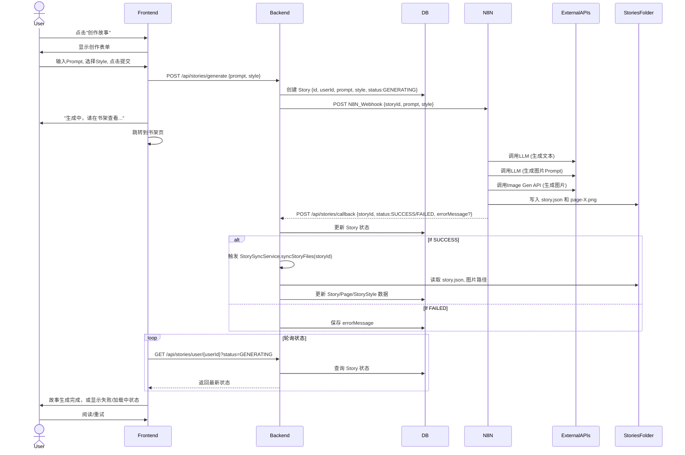

# DESIGN: MVP3 - 故事创作与 N8N 集成架构设计

## 1. 系统架构概览 (System Overview)

MVP3 引入了用户驱动的创作流程，通过后端 API 作为 N8N 工作流的桥梁，实现异步的故事生成。核心在于Backend 驱动 N8N 创作，并接收 N8N 回调，最终同步数据到 DB。

```mermaid
graph TD
    User[用户 (Frontend)] -->|1. POST /api/stories/generate| Backend[Spring Boot Backend]
    Backend -->|2. 创建 Story (GENERATING)| Database[PostgreSQL DB]
    Backend -->|3. POST N8N_Webhook (storyId, prompt, style)| N8N[N8N Workflow]
    
    N8N -->|4. LLM & Image Gen API| ExternalAPIs[OpenAI/Gemini/SD]
    N8N -->|5. 写入文件| StoriesFolder[共享文件系统: /stories/{storyId}/{style}]
    N8N -->|6. POST /api/stories/callback (storyId, status)| Backend
    
    Backend -->|7. 更新 Story 状态 (PUBLISHED/FAILED)| Database
    Backend -->|8. 触发 StorySyncService| StorySync[故事文件同步服务]
    StorySync -->|9. 读取文件| StoriesFolder
    StorySync -->|10. 更新 Story/Page 数据| Database
    
    Frontend -->|11. 轮询 Story 状态| Backend
    Frontend -->|12. 渲染书架/阅读页| User
```

## 2. 核心模块设计 (Core Modules)

### 2.1 数据模型扩展 (Backend - `entity/Story.java`)

为 `Story` 实体新增字段：

```java
public enum StoryStatus {
    DRAFT,          // 草稿 (预留，MVP3暂不实现)
    GENERATING,     // 正在生成中
    PUBLISHED,      // 已发布，可阅读
    FAILED,         // 生成失败
}

@Entity
public class Story {
    // ... 现有字段
    private UUID userId; // 关联用户ID
    private StoryStatus status; // 新增：故事生成状态
    private String generationPrompt; // 新增：用户输入的原始Prompt
    private String selectedStyleId; // 新增：用户选择的风格ID
    private String errorMessage; // 新增：生成失败时的错误信息
    private LocalDateTime createdAt; // 新增：创建时间
    private LocalDateTime updatedAt; // 新增：更新时间
}
```

### 2.2 后端 API 设计 (Backend)

#### 1. `POST /api/stories/generate`
- **功能**: 用户提交创作请求，触发 N8N 工作流。
- **请求体**: 
    ```json
    {
        "prompt": "一只想飞的企鹅",
        "style": "迪士尼"
    }
    ```
- **响应体**: 
    ```json
    {
        "storyId": "a1b2c3d4-e5f6-7890-1234-567890abcdef"
    }
    ```
- **逻辑**: 
    1. 验证用户身份 (`userId` 从 JWT 获取)。
    2. 生成新的 `UUID` 作为 `storyId`。
    3. 在 `Story` 表中创建新记录，`status = GENERATING`，保存 `userId`, `prompt`, `style`, `createdAt`。
    4. 构建 N8N Webhook URL (从 `application.yml` 获取)，包含 `storyId`, `prompt`, `style` 等参数。
    5. 发送 HTTP POST 请求到 N8N Webhook。
    6. 返回 `storyId`。

#### 2. `POST /api/stories/callback`
- **功能**: 接收 N8N 的生成结果通知，更新故事状态并同步数据。
- **请求体**: 
    ```json
    {
        "storyId": "a1b2c3d4-e5f6-7890-1234-567890abcdef",
        "status": "SUCCESS", // or "FAILED"
        "errorMessage": "AI 生成图片失败" // 仅当FAILED时有
    }
    ```
- **响应体**: `200 OK` (空)。
- **逻辑**: 
    1. 根据 `storyId` 查找 `Story` 记录。
    2. 更新 `status` 字段。
    3. 如果 `status = FAILED`，保存 `errorMessage`。
    4. 如果 `status = SUCCESS`，调用 `StorySyncService.syncStoryFiles(storyId)`，将 `stories/{storyId}` 目录下的 `story.json` 和图片路径等信息解析并更新到 `Story` 及其关联的 `Page`、`StoryStyle` 等表中。

### 2.3 前端组件设计 (Frontend)

#### 1. `CreateStoryPage` (或 `CreateStoryModal`)
- **UI**: 包含 `Prompt` 输入框 (`textarea`)，`Style` 下拉选择器 (`select`)，`Submit` 按钮。
- **逻辑**: 
    1. 获取可用风格列表 (可能通过 `GET /api/styles` 或直接从 `story-manifest.json` 中提取)。
    2. 表单验证。
    3. 调用 `POST /api/stories/generate`。
    4. 成功后，显示 Toast 通知并跳转到 `HomePage` (书架)。

#### 2. `HomePage` (书架页)
- **UI**: 现有故事列表的基础上，区分“我的创作”区域。
- **逻辑**: 
    1. 页面加载时，获取用户所有故事，包括 `GENERATING`, `PUBLISHED`, `FAILED` 状态。
    2. 对于 `GENERATING` 状态的故事，显示特殊卡片 (例如灰色、带加载动画)。
    3. 实现轮询 (`useQuery` 的 `refetchInterval`)，定期检查 `GENERATING` 状态故事的最新状态。

#### 3. `StoryCard` (故事卡片)
- **UI**: 
    - 正常状态：显示封面、标题。
    - 生成中状态：显示骨架屏或 Loading 动画，标题显示“正在生成中...”
    - 失败状态：显示失败图标和“生成失败”提示。

### 2.4 N8N 工作流设计 (外部依赖)

#### 1. `Webhook` 节点
- 接收来自 Backend 的 `storyId`, `prompt`, `style`。

#### 2. **LLM 节点 (Text Generation)**
- **输入**: `prompt`。
- **输出**: 完整的故事文本 (分段，可能包含页码标记)。

#### 3. **LLM 节点 (Image Prompt Generation)**
- **输入**: 故事文本 (每页内容)。
- **输出**: 每页对应的图片生成提示词 (`imagePrompt-pageX.json` 内容)。

#### 4. **图像生成节点 (Image Generation)**
- **输入**: 每页的图片提示词、`style`。
- **输出**: 图片文件 (PNG)。

#### 5. **文件写入节点 (File System Operations)**
- **路径**: 动态构造 `/home/ubuntu/n8n/workspace/storybook/stories/{storyId}/{style}`。
- **内容**: 写入 `story.json` (包含故事文本和图片占位符路径)，写入 `page-X.png` 文件。

#### 6. `Webhook` 回调节点
- **调用**: `POST http://<backend_ip>:<backend_port>/api/stories/callback`。
- **参数**: `storyId`, `status` (`SUCCESS`/`FAILED`), `errorMessage`。

## 3. 详细数据流与时序 (Data Flow & Sequence Diagram)



## 4. 目录结构规划

### 4.1 Backend
```
backend/
├── src/
│   ├── main/
│   │   ├── java/com/storybook/
│   │   │   ├── controller/      # AuthController, StoryController (新增 generate, callback)
│   │   │   ├── dto/             # GenerateRequest, CallbackRequest
│   │   │   ├── entity/          # Story (新增 status, prompt, style, userId)
│   │   │   ├── repository/
│   │   │   └── service/         # StoryService, StorySyncService (扩展)
│   │   └── resources/
│   │       └── application.yml  # N8N webhook URL配置
└── pom.xml
```

### 4.2 Frontend
```
web/
├── src/
│   ├── api/                   # 扩展 stories API
│   ├── components/
│   │   ├── common/
││   └── home/                # 扩展 StoryCard (生成中状态)
│   │   └── create-story/      # 新增创作界面组件
│   ├── pages/
│   │   ├── HomePage.tsx       # 扩展状态显示，添加创作入口
│   │   └── CreateStoryPage.tsx # 新增创作页面
│   ├── types/                 # 扩展 Story 状态类型
│   └── utils/
└── ...
```
