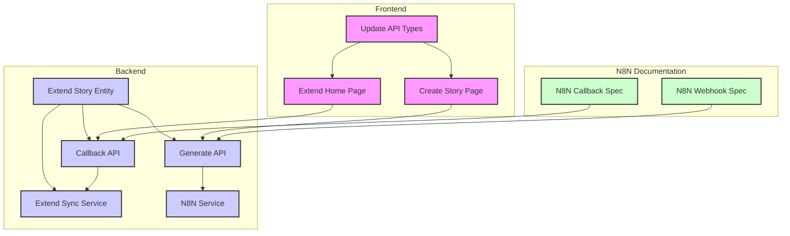

# TASK: MVP3 - 任务分解清单

## 1. 后端核心功能扩展 (Backend Core)

- [ ] **TASK-BE-01: 扩展 Story 实体与 Repository**
    - **Input**: 现有 `backend/src/main/java/com/storybook/entity/Story.java`。
    - **Action**: 
        - 在 `Story` 实体中添加 `userId`, `status` (Enum), `generationPrompt`, `selectedStyleId`, `errorMessage` 字段。
        - 添加 `createdAt`, `updatedAt` 时间戳字段。
        - 更新 `StoryRepository` 以支持新的字段查询。
    - **Output**: 数据库结构更新，实体类和 Repository 兼容新字段。

- [ ] **TASK-BE-02: 实现故事生成 API (`POST /api/stories/generate`)**
    - **Input**: `DESIGN_MVP3.md` 中定义的 API 规范。
    - **Action**: 
        - 创建 `GenerateStoryRequest` DTO。
        - 在 `StoryController` 中新增 `@PostMapping("/generate")` 接口。
        - 实现业务逻辑：验证用户、生成 `storyId` (UUID)、创建 `Story` 记录 (状态 `GENERATING`)。
        - 调用 `N8NService` (新增) 发送 Webhook 请求到 N8N。
    - **Output**: 可测试的 `generate` API，成功后在 DB 插入一条 `GENERATING` 状态的 Story 记录并触发 N8N Webhook。

- [ ] **TASK-BE-03: 实现 N8N 回调 API (`POST /api/stories/callback`)**
    - **Input**: `DESIGN_MVP3.md` 中定义的 API 规范。
    - **Action**: 
        - 创建 `StoryCallbackRequest` DTO。
        - 在 `StoryController` 中新增 `@PostMapping("/callback")` 接口。
        - 实现业务逻辑：根据 `storyId` 更新 `Story` 状态 (`PUBLISHED`/`FAILED`)，保存 `errorMessage`。
        - 如果状态为 `PUBLISHED`，调用 `StorySyncService.syncStoryFiles(storyId)` 触发单故事文件同步。
    - **Output**: 可测试的 `callback` API，成功更新 DB 状态，并触发文件同步（如果成功）。

- [ ] **TASK-BE-04: 扩展故事文件同步服务 (`StorySyncService`)**
    - **Input**: 现有 `StorySyncService`。
    - **Action**: 
        - 扩展 `syncStoryFiles` 方法，使其能根据传入的 `storyId` 扫描指定 `stories/{storyId}` 目录。
        - 解析 `story.json` 和图片文件路径，更新 `Story`, `StoryPage`, `StoryStyle` 等关联表中的数据。
        - 处理文件不存在、格式错误等异常情况。
    - **Output**: `StorySyncService` 能够根据 `storyId` 准确同步单个故事数据。

- [ ] **TASK-BE-05: 实现 N8N 调用服务 (`N8NService`)**
    - **Input**: `application.yml` 中配置的 N8N Webhook URL。
    - **Action**: 
        - 创建 `N8NService`，封装调用 N8N Webhook 的 HTTP 请求逻辑。
        - 使用 `RestTemplate` 或 `WebClient` 发送 POST 请求，传递 `storyId`, `prompt`, `style` 等参数。
        - 增加错误处理和日志记录。
    - **Output**: 独立的 `N8NService`，后端能成功调用 N8N Webhook。

## 2. 前端功能开发 (Frontend Features)

- [ ] **TASK-FE-01: 创建故事创作页面 (`CreateStoryPage.tsx`)**
    - **Input**: 现有前端项目结构，MVP1/MVP2 的 UI 规范。
    - **Action**: 
        - 创建新的 React 页面组件 (`src/pages/CreateStoryPage.tsx`)。
        - 实现表单 UI：Prompt (textarea)、风格选择器 (select 或卡片组)。
        - 调用后端 `generate` API，处理提交后的成功/失败反馈。
        - 提交成功后导航到 `HomePage`。
    - **Output**: 用户友好的故事创作页面，可提交请求。

- [ ] **TASK-FE-02: 扩展书架页 (`HomePage.tsx`)**
    - **Input**: 现有 `HomePage.tsx`，`useStoryManifest` hook。
    - **Action**: 
        - 在 `HomePage` 中添加“我的创作”区块，专门显示用户提交的故事。
        - 扩展 `StoryCard` 组件，根据 `Story` 的 `status` 字段显示不同 UI（加载动画、失败信息）。
        - 实现轮询机制 (使用 `react-query` 的 `refetchInterval`)，定期更新用户创作故事的状态。
    - **Output**: 书架页能正确显示生成中的故事卡片，并实时更新状态。

- [ ] **TASK-FE-03: 更新 API 客户端与类型定义**
    - **Input**: 现有 `web/src/api/client.ts` 和 `web/src/types/index.ts`。
    - **Action**: 
        - 在 `client.ts` 中添加调用 `generate` 和 `callback` API 的方法。
        - 更新 `index.ts` 中的 `Story` 类型定义，匹配后端新增字段。
    - **Output**: 前后端数据交互的类型安全和功能实现。

## 3. N8N 工作流集成支持 (N8N Integration Support)

- [ ] **TASK-N8N-01: 提供 N8N Webhook 接口规范**
    - **Input**: 后端 `generate` API 请求参数。
    - **Action**: 编写文档，明确 N8N Webhook 接收的 JSON 结构、参数含义。
    - **Output**: 详细的 N8N Webhook 接口文档。

- [ ] **TASK-N8N-02: 提供 N8N 回调接口规范**
    - **Input**: 后端 `callback` API 请求参数。
    - **Action**: 编写文档，明确 N8N 完成后调用 Backend `callback` API 的 JSON 结构、状态字段。
    - **Output**: 详细的 N8N 回调接口文档。

## 依赖关系图

