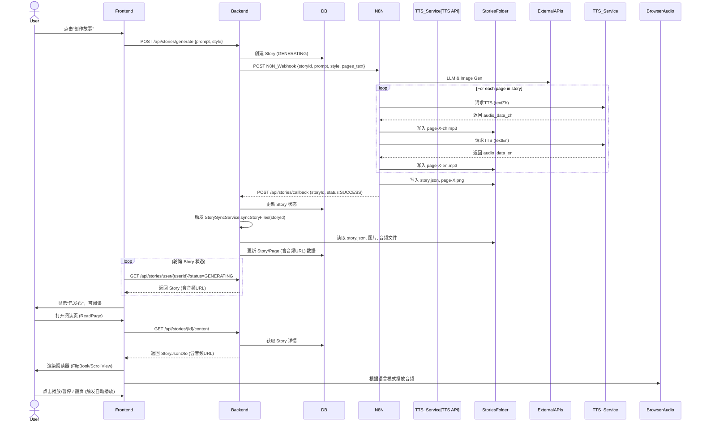

# DESIGN: MVP4 - 语音播放故事架构设计

## 1. 系统架构概览 (System Overview)

MVP4 在现有故事生成和阅读流程中引入音频生成与播放。核心改动围绕 `StoryPage` 实体增加音频文件路径，N8N 生成音频，后端同步，前端播放。

```mermaid
graph TD
    subgraph "Story Generation (MVP3 Extended)"
        User[用户 (Frontend)] -->|1. POST /api/stories/generate| Backend[Spring Boot Backend]
        Backend -->|2. N8N Webhook| N8N[N8N Workflow]
        N8N -->|3. LLM & Image Gen API| ExternalAPIs[OpenAI/Gemini/SD]
        
        N8N --"4. TTS API"--> TTS_Service[OpenAI TTS/Google TTS]
        TTS_Service --"5. Audio Files"--> N8N

        N8N -->|6. 写入文件: story.json, page-X-en.mp3, page-X-zh.mp3| StoriesFolder[共享文件系统: /stories/{storyId}/]
        N8N -->|7. 写入图片: page-X.png| StyleSubFolder[共享文件系统: /stories/{storyId}/{style}]
        N8N -->|8. POST /api/stories/callback| Backend
    end
    
    subgraph "Story Consumption (MVP4 Augmented)"
        Backend -->|9. StorySyncService| StoriesFolder
        Backend -->|10. 更新 Story/Page 数据 (含音频URL)| Database[PostgreSQL DB]
        Frontend[React Frontend] -->|11. GET /api/stories/{id}/content| Backend
        Backend -->|12. 返回 StoryJsonDto (含音频URL)| Frontend
        Frontend -->|13. Load Audio| BrowserAudio[浏览器 Audio API]
        Frontend -->|14. Render Reading Page & Controls| User
    end

```

## 2. 核心模块设计 (Core Modules)

### 2.1 数据模型扩展 (Backend - `entity/StoryPage.java`)

为 `StoryPage` 实体新增字段：

```java
@Entity
public class StoryPage {
    // ... 现有字段
    private String audioUrlZh; // 新增：中文音频文件URL
    private String audioUrlEn; // 新增：英文音频文件URL
}
```

### 2.2 后端服务扩展 (Backend - `service/StorySyncService.java`)

修改 `StorySyncServiceImpl.java` 中的 `syncStoryFilesInternal` 方法：

1.  **文件查找**: 在 `stories/{storyId}/` 目录下，查找 `page-<页码>-zh.mp3` 和 `page-<页码>-en.mp3` 文件。
2.  **URL 构建**: 将找到的音频文件构建为 `/stories/{storyId}/page-<页码>-zh.mp3` 这样的 URL 路径。
3.  **实体更新**: 将构建好的 URL 保存到 `StoryPage` 对应的 `audioUrlZh` 和 `audioUrlEn` 字段中。
4.  **异常处理**: 如果音频文件不存在，则对应的 URL 字段可以为 `null` 或空字符串，不应中断整个同步流程。

### 2.3 前端组件设计 (Frontend)

#### 1. `StoryPage` 类型更新 (`web/src/types/index.ts`)
```typescript
export interface StoryPage {
  // ... 现有字段
  audioUrlZh?: string; // 可选，因为可能没有音频
  audioUrlEn?: string; // 可选
}
```

#### 2. `ReaderControls` 组件 (`web/src/components/reader/ReaderControls.tsx`)
- **UI**: 
    - 增加一个全局的“播放/暂停”按钮。
    - 增加一个“自动播放 (Auto-play)”开关。
- **逻辑**: 
    - 管理 `isPlaying` (播放状态) 和 `autoPlayEnabled` (自动播放开关) 状态。
    - 播放按钮点击 -> 切换播放状态，并通知阅读器组件。
    - 自动播放开关切换 -> 更新设置，并可能触发当前页播放。

#### 3. `useAudioPlayer` Hook (新增 `web/src/hooks/useAudioPlayer.ts`)
- **功能**: 封装 `HTMLAudioElement` 的播放、暂停、加载逻辑。
- **输入**: 当前页的 `audioUrlZh`, `audioUrlEn`, `languageMode`。
- **输出**: `play`, `pause`, `isPlaying`, `loadAudio` 等函数和状态。
- **逻辑**: 
    - 根据 `languageMode` 和 `currentAudioUrl` 动态加载音频。
    - 自动管理音频的 `play`, `pause`, `currentTime` 等。
    - 提供事件回调 (如 `onEnded`)。

#### 4. 阅读器视图 (`FlipBookViewer.tsx`, `ScrollViewer.tsx`)
- **输入**: 接收 `useAudioPlayer` 的控制函数和状态，以及当前页的 `audioUrlZh`, `audioUrlEn`。
- **逻辑**: 
    - 监听 `ReaderControls` 的播放指令。
    - 监听翻页事件：如果 `autoPlayEnabled` 为 `true`，则在新页加载后，根据当前语言模式自动调用 `play`。
    - 在组件卸载时调用 `pause` 清理。

#### 5. `ReadPage.tsx` (协调器)
- **功能**: 协调 `ReaderControls` 和阅读器视图。
- **逻辑**: 
    - 管理 `currentPage`, `languageMode`, `autoPlayEnabled` 状态。
    - 将这些状态和音频播放控制函数传递给子组件。

### 2.4 N8N 工作流设计 (External)

#### 1. `TTS Node` (Text-to-Speech)
- **输入**: 每页的中文文本 (`$json.body.pages[0].textZh`) 和英文文本 (`$json.body.pages[0].textEn`)。
- **服务集成**: 配置 OpenAI TTS API, Google Cloud TTS API 等。
- **输出**: MP3 格式的音频数据 (Base64 或二进制流)。

#### 2. `Write Binary File Node` (文件写入)
- **输入**: TTS 节点生成的音频数据。
- **路径**: 动态构造 `stories/{storyId}/page-<页码>-zh.mp3` 和 `stories/{storyId}/page-<页码>-en.mp3`。
- **文件名**: `page-{{$json.pageNumber}}-zh.mp3` 和 `page-{{$json.pageNumber}}-en.mp3`。

## 3. 详细数据流与时序 (Data Flow & Sequence Diagram)



## 4. 目录结构规划

### 4.1 Backend
```
storybook-service/
├── src/
│   ├── main/
│   │   ├── java/com/storybook/
│   │   │   ├── entity/          # StoryPage (新增 audioUrlZh, audioUrlEn)
│   │   │   └── service/         # StorySyncService (扩展)
└── ...
```

### 4.2 Frontend
```
web/
├── src/
│   ├── components/
│   │   └── reader/          # ReaderControls (扩展), AudioPlayer (新增)
│   ├── hooks/               # useAudioPlayer (新增)
│   ├── pages/               # ReadPage (扩展)
│   ├── types/               # StoryPage (扩展)
└── ...
```
