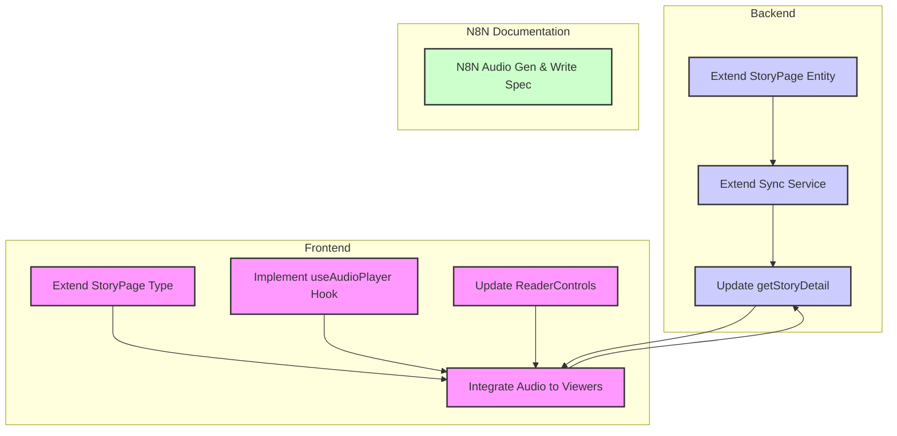

# TASK: MVP4 - 任务分解清单

## 1. 后端功能扩展 (Backend)

- [ ] **TASK-BE-01: 扩展 StoryPage 实体与 Repository**
    - **Input**: 现有 `storybook-service/src/main/java/com/storybook/entity/StoryPage.java`。
    - **Action**: 
        - 在 `StoryPage` 实体中添加 `audioUrlZh` 和 `audioUrlEn` 字段 (`String` 类型)。
        - 如果需要，更新 `StoryPageRepository` (通常 JPA 自动支持，无需额外修改)。
    - **Output**: 数据库结构更新，实体类兼容新字段。

- [ ] **TASK-BE-02: 扩展故事文件同步服务 (`StorySyncService`)**
    - **Input**: 现有 `StorySyncServiceImpl.java`。
    - **Action**: 
        - 修改 `syncStoryFilesInternal` 方法。
        - 在 `stories/{storyId}/` 目录下查找 `page-<页码>-zh.mp3` 和 `page-<页码>-en.mp3` 文件。
        - 构建相应的 URL 路径 (`/stories/{storyId}/page-<页码>-zh.mp3`)。
        - 将 URL 保存到 `StoryPage` 对象的 `audioUrlZh` 和 `audioUrlEn` 字段中。
        - 处理文件不存在的情况 (URL 为 `null` 或空字符串)。
    - **Output**: 后端能正确解析故事文件，并将音频 URL 存储到数据库。

- [ ] **TASK-BE-03: 更新 StoryService 获取故事详情接口**
    - **Input**: 现有 `StoryServiceImpl.java` 中的 `getStoryDetail(String id)`。
    - **Action**: 确保在构建 `StoryJsonDto` 时，也包含 `StoryPage` 中的 `audioUrlZh` 和 `audioUrlEn` 字段。
    - **Output**: 前端获取的故事详情包含音频 URL。

## 2. 前端功能开发 (Frontend Features)

- [ ] **TASK-FE-01: 扩展 StoryPage 类型定义**
    - **Input**: `web/src/types/index.ts`。
    - **Action**: 在 `StoryPage` 接口中添加 `audioUrlZh?: string;` 和 `audioUrlEn?: string;` 字段。
    - **Output**: 前端类型定义支持音频 URL。

- [ ] **TASK-FE-02: 实现 `useAudioPlayer` Hook**
    - **Input**: 无。
    - **Action**: 
        - 创建 `web/src/hooks/useAudioPlayer.ts`。
        - 封装 `HTMLAudioElement` 的播放、暂停、加载、卸载逻辑。
        - 提供 `play(url: string)`, `pause()`, `isPlaying: boolean`, `duration`, `currentTime` 等状态和方法。
        - 内部管理 `Audio` 实例，处理 `onended` 事件。
    - **Output**: 可复用的音频播放 Hook。

- [ ] **TASK-FE-03: 更新 `ReaderControls` 组件**
    - **Input**: 现有 `web/src/components/reader/ReaderControls.tsx`。
    - **Action**: 
        - 添加播放/暂停按钮 (icon)。
        - 添加“自动播放”开关 (checkbox/toggle switch)。
        - 按钮状态（播放/暂停）与 `useAudioPlayer` 的 `isPlaying` 状态联动。
        - 自动播放开关状态的持久化 (例如使用 `localStorage` 或 `Context`)。
    - **Output**: 阅读页控制栏拥有音频播放控制 UI。

- [ ] **TASK-FE-04: 集成音频播放到 `ReadPage` 和阅读器视图**
    - **Input**: `web/src/pages/ReadPage.tsx`, `FlipBookViewer.tsx`, `ScrollViewer.tsx`。
    - **Action**: 
        - 在 `ReadPage.tsx` 中使用 `useAudioPlayer` Hook，并管理 `autoPlayEnabled` 状态。
        - 将当前页的音频 URL、语言模式、播放控制函数 (`play`, `pause`) 和 `autoPlayEnabled` 传递给 `FlipBookViewer` 和 `ScrollViewer`。
        - 在 `FlipBookViewer` 和 `ScrollViewer` 内部：
            - 监听翻页事件。
            - 如果 `autoPlayEnabled` 为 `true`，根据当前语言模式自动调用 `play(audioUrl)`。
            - 确保在组件卸载或翻页时停止当前音频播放。
            - 在语言切换时，自动切换播放对应的语言音频。
    - **Output**: 阅读页能根据翻页、语言切换和自动播放设置正确播放音频。

## 3. N8N 工作流集成支持 (N8N Integration Support)

- [ ] **TASK-N8N-01: 提供 N8N 音频生成与写入规范**
    - **Input**: MVP4 需求。
    - **Action**: 编写文档，明确 N8N 工作流中 TTS 节点的使用、音频文件命名约定、存储路径和文件写入步骤。
    - **Output**: 详细的 N8N 音频生成工作流指南。

## 依赖关系图

